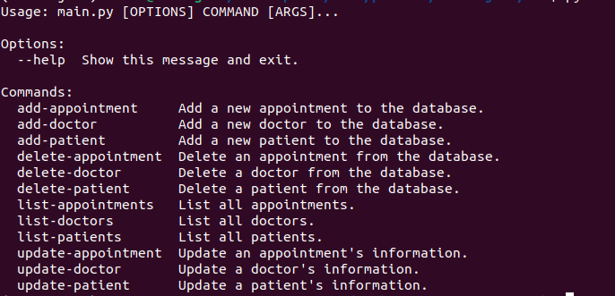

# Hospital Management System

#### Created By Martin Nyaga 04-9-2023

## Git Link

[Git](https://github.com/MartinNyaga/CLI-HMS)

## Description
This is a Hospital Management System python app that executed actions in the Command Line Interface. The database contains three different tables. The doctor table to store the doctor's information, The patient table to store patients data and the appointment table to store a booked appointment together with the doctor in charge and the patient who booked the appointment. Here the user is able to add, read, update or delete records from any of the tables listed through the CLI.

## Screenshot 

- CLI

  

#### How to run code
- Git clone repo to your local
- Open directory to file location
- Run python3 lib/main.py on your terminal
- Follow instructions on the terminal to perfom CRUD actions on the DataBase 

## Setup Requirements

- Git
- Code editor of choice
- Github

## Technologies Used

The following have been used on this project:

- Python
- sqlalchemy

## Known Bugs

No known bugs at the moment

## Support and contact details 

To make a contribution to the code used or any suggestions you can click on the contact link and email me your suggestions.

- Email: martin.nyaga@student.moringaschool.com

## License

Copyright (c) {{ 2023 }}, {{ Martin Nyaga }}

Permission to use, copy, modify, and/or distribute this software for any
purpose with or without fee is hereby granted, provided that the above
copyright notice and this permission notice appear in all copies.

THE SOFTWARE IS PROVIDED "AS IS" AND THE AUTHOR DISCLAIMS ALL WARRANTIES WITH
REGARD TO THIS SOFTWARE INCLUDING ALL IMPLIED WARRANTIES OF MERCHANTABILITY AND
FITNESS. IN NO EVENT SHALL THE AUTHOR BE LIABLE FOR ANY SPECIAL, DIRECT,
INDIRECT, OR CONSEQUENTIAL DAMAGES OR ANY DAMAGES WHATSOEVER RESULTING FROM
LOSS OF USE, DATA OR PROFITS, WHETHER IN AN ACTION OF CONTRACT, NEGLIGENCE OR
OTHER TORTIOUS ACTION, ARISING OUT OF OR IN CONNECTION WITH THE USE OR
PERFORMANCE OF THIS SOFTWARE.